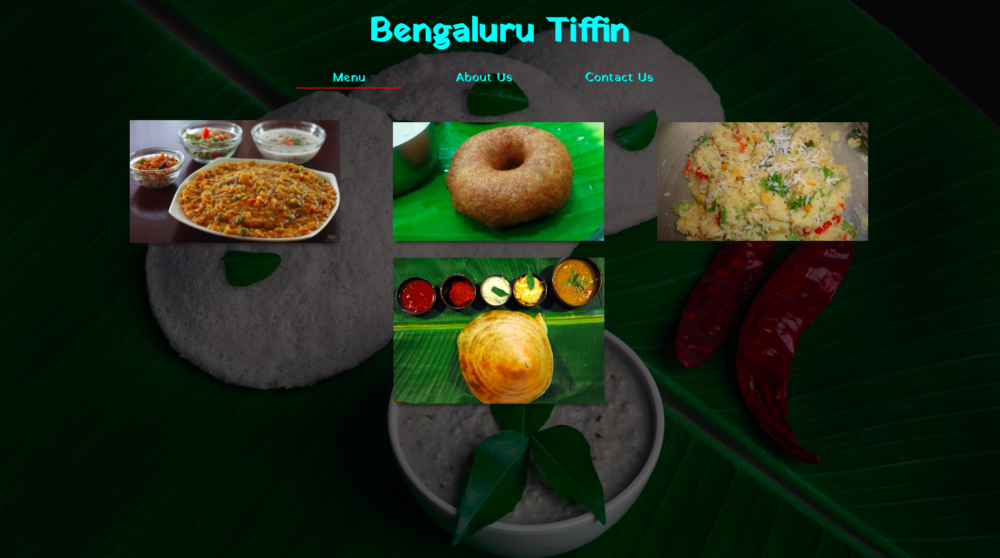

# Restaurant-Page
This demo project renders the landing page for a restaurant's website.

> In this project I demonstrate, using Webpack, the creation of a static website. The
front-end code is very modular, and is bundled together along with all other static
assets - fonts, images, styles, scripts and external NPM libraries using Webpack and it's
plugins and loaders.

## Built With

- JavaScript (ES6), HTML and CSS
- Webpack and plugins
- Tested on Chrome, Firefox and edge browsers.

## Live Demo

[Live Demo Link](https://nostalgic-turing-135622.netlify.app/)

## Getting Started

To get a local copy up and running follow these simple example steps.

### Prerequisites

- NPM, Nodejs, Sass

### Setup

- Clone this repo
- Have Sass installed (Preferably Dart Sass)

### Install

- `npm install`

### Usage

- `npm run server`
- The live server should automatically open the site in your browser.
- Or, look in the terminal for the server localhost address and open it manually in browser.

Or

- Build bundled assets `npm run build`
- Open `index.html` generated in the `dist` folder after bundling by Webpack

### Deployment

The project is not setup for production. The bundled files are generated in Development mode
for analysis and debugging purpose.

## Author

👤 **Keshav Chakravarthy**

- Github: [@keshav-c](https://github.com/keshav-c/)
- Linkedin: [k3shavchakravarthy](https://www.linkedin.com/in/k3shavchakravarthy/)

## 🤝 Contributing

Contributions, issues and feature requests are welcome!

Feel free to check the [issues page](https://github.com/keshav-c/Restaurant-Page/issues).

## Show your support

Give a ⭐️ if you like this project!

## Acknowledgments

- Microverse
- The Odin Project
- The amazing people making Webpack and it's plugins, loaders etc.

## 📝 License

This project is [MIT](https://opensource.org/licenses/MIT) licensed.
